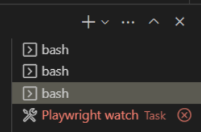
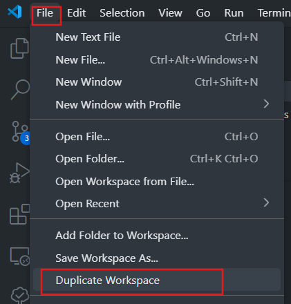
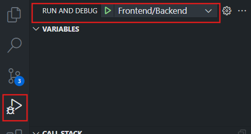
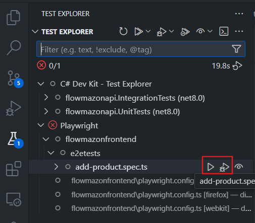

## Overview

## After Cloning the Repo

1.  **Set up local PostgreSQL database:** This is used for local development and debugging whereas local continuous testing setup which uses Docker Compose creates its own, new database container separate from this every time `docker compose up` is run. Ensure that the local database is set up as follows:

    - Make sure PostgreSQL is installed on your machine.
    - Create a database named `FlowmazonDB` in your local PostgreSQL server.
    - Using pgAdmin, right-click the database you just created and select **Query tool** (or connect to the database using some other tool for executing queries such as `psql`)
    - execute the following script against FlowmazonDB database. This creates a database, and a user, and assigns privileges to this user on the database (we don't want to use the superadmin `postgres` user, hence why we are creating a dedicated user for the database with enough privileges for development):

      ```sql
      CREATE USER <pick a username> WITH PASSWORD '<pick a strong password>';
      ALTER DATABASE FlowmazonDB OWNER TO <username you picked>;
      ```

    - Navigating to folder `flowmazonbackend/flowmazonapi` on the terminal
    - Run command `dotnet user-secrets set ConnectionStrings:FlowmazonDB "Server=127.0.0.1;Port=5432;Database=FlowmazonDB;User Id=flowmazon_app_user;Password=<PASSWORD YOU CHOSE FOR flowmazon_app_user>;"`
    - Run `dotnet ef database update` to migrate the database to the current state of the EF Core model in `flowmazonapi` project.

2.  **Create env file for Docker Compose:**

    - Duplicate `compose.env.template` as a file named `compose.env` (in the same folder, i.e. in solution root).
    - Pick a strong password and replace `<postgres user password>` in the new file with it.
    - Pick a strong password and replace **every occurrence** of `<app user password>` in the new file with it.

## Architecture

## Configuration

For details of configuration key/value pairs that need to be provided to each service, and how these may be provided - e.g. using config files in local development but environment variables at build and/or run of deployment or containers - see the READMEs of respective services ([frontend app](./flowmazonfrontend/README.md) and [backend api](./flowmazonbackend/flowmazonapi/README.md)).

For environment-specific sources of configuration data, see [Environments](#environments) section below.

## Environments

Following environments are set up to run app and/or tests.

### Environment 1: Local Fullstack Debugging

Use VS Code compund launch configuration **Frontend/Backend** to run in debug mode. Just select from launch configurations dropdown it in Debug sidebar window (Ctrl), then whenever you upress F5, the configuration will launch.

Bear in mind that to stop debugging with this compound configuration, you will need to press Shift+F5 twice and not once.

The compound launch configuration is defined in `compounds` key and the individual configurations it is composed of are defined in `configurations` key in `.vscode/launch.json`.

The database this launch configuration (and quite possibly every VS Code launch configuartion) uses is `FlowmazonDB` running on a PostgreSQL database server running on the local machine.

**Configuration:** Values for required and some optional configuration keys are specified as follows:

- In each of the two launch configurations - `.NET Core: debug in full stack` and `Next.js: debug in full stack` - that make up the compound launch configuration, there is an `env`object that provides values of some required and/or optional configuration keys for the corresponding app.

- Value `ConnectionStrings__FlowmazonDB` key's value is taken from .NET User Secrets Manager which stores it in a file at path `%APPDATA%\Microsoft\UserSecrets\<user_secrets_id>\secrets.json` where `user_secrets_id` is given in property `<UserSecretsId>` in [flowmazonapi.csproj](./flowmazonbackend/flowmazonapi/flowmazonapi.csproj).
  User Secrets Manager may also be used for storing other development time secrets in the future.

- For ASP.NET Core app, some settings are being taken from `appSettings.json` and `appSettings.Development.json` (the latter applies, and overrides what is in `appSettings.json`, because the app is launched in `Development` environment by the launch configuration).
  The settings configured in these config files are **currently all optional and not very important:** `AllowedHosts: "*"`- which means there is no host filtering at all, this is the default anyway - and Log Levels for some namespaces. **These were all part of scaffolded config files; I haven't changed these files at all**.

### Local Continuous Testing

Each of the following test suites is run continuously in VS Code:

- Storybook unit tests for components in the Next.js app
- Playwright integration tests (end-to-end tests) run against the Next.js app that is running toghether with the backend .NET Core API and a PostgreSQL test database
- Integration tests of the .NET Core API

For each of these suites, a task in `tasks.json` starts on `folderOpen` which in turn runs a command - either an executable like `dotnet test` or a script defined in `package.json` that is run using `npm run <script name>` - in a separate terminal window that watches test and code-under-tests file and start the test suite execution whenever a change is detected.

Each such task in `tasks.json` also defines a `problemMatcher` which contains regular expressions to detect start and end of test suite execution and any problems reported on the terminal (most likely a failed test but could also be a build error or some other error). If an error is detected by the `problemMatcher`, the terminal header is coloured red:



Thus the tests suites quietly run in the background and something is brought to our attention only when there is an error (by the terminal header turning red). This is how a continuous testing mode should be.

Continuous testing environments - one for each test suite - are described in subsections below.

#### Environment 2: Unit Tests - Storybook

- Task `Storybook watch` in `.vscode/tasks.json` runs on `folderOpen` and runs script `test-storybook:watch` in `flowmazonfrontend/package.json`. This is the watch script that runs forever and restarts a run of the Storybook tests suite whenever a change to code in Next.js app is detected.

- Tests for component are located next to the component in a `.stories.tsx` file.

- **Configuration:**

  - Config values required by app-under-test (see [README for the Next.js app for its requried and optional config keys](./flowmazonfrontend/README.md)) are stored in [`.env.development`](./flowmazonfrontend/.env.development) file in the Next.js app folder.
    The reason why I am using a config file rather than provide config key-values as environment variables is because `NEXT*PUBLIC*`variables, that need to be available during Next.js app's build as they are emitted into the client-side browser bundle, wer not getting passed by`test-storybook`from environment variables to the NExt.js app build process (Storybook builds its own bundle for Next.js and its build I aam quite sure is quite different from`next build`).

  - Configuration for Storybook is in the files in `flowmazonfrontend/.storybook` folder.

  - Port at which Storybook runs and whether or not a new browser with URL set to Storybook's local URL is opened when Storybook deve server starts are in the watch task in `package.json`.

- You can also manually navigate to the URL of the Storybook dev server exposed by the continuous testing task (it opens by default when Storybook dev server starts for local continuous testing).

- In order to debug frontend Next.js app (which runs entirely in the browser, being a Next.js Pages router app), run the storybook app in debug mode using the VS Code launch configuration `Storybook Debug Firefox`.

  **Now your breakpoints in frontend app code, as well as in Storybook tests would get hit**. This is because Storybook build bundles storybook tests together with the Next.js app under tests into a single browser bundle. It is this bundle that runs as the Storybook app when you navigate to Storybook dev server's URL.

#### Environment 3: Integration Tests 1 of 2 - API tests of .NET Core minimal API

- Task `.NET tests watch` in `tasks.json` runs on `folderOpen` and runs script `test-dotnet:watch` in `package.json` in the root folder. This in turn continuously monitors the .NET projects in `flowmazonbackend` folder and, upon detecting a change, rebuild them, then launches unit test suite and integration tests suite in parallel.
  **TODO: Make test suite runs serially rather than in parallel**. I am getting nothing from parallel runs of unit and integration tests as either one of them saturate my available cores. Making the two test suites run serially would also eliminate this package.json script and everything can be done via `dotnet watch test`. Even though this can only watch a single project at a time, we can inlude files in other .NET projects in the `.csproj` of the project being watched using `<Watch>` elements.

- The [integration test suite](./flowmazonbackend/flowmazonapi.IntegrationTests/) uses [TestContainers](https://testcontainers.com/guides/getting-started-with-testcontainers-for-dotnet/) to build a Docker container of the API app-under-test from its [Dockerfile](./flowmazonbackend/Dockerfile). This is run together with a new standard PostgreSQL container (provided by TestContainers) in which the database is migrated in C# test code just before the start of the test run.

- **Configuration:** See [flowmazonapi README](./flowmazonbackend//flowmazonapi/README.md) for a description of the API app's required and optional configuration keys. Values for vairious keys (unless optional and default value is used) are sourced as follows:
  - `ConnectionStrings__FlowmazonDB` is taken from .NET User Secrets Manager. See section [Environment 1: Local Fullstack Debugging](#environment-1) for details on this config source.
  - `ALLOWED_CORS_ORIGINS` is set as an environment variable in the NPM script that is run by the task in `tasks.json` (to a dummy value, as it is a required key).

#### Environment 4: Integration Tests 2 of 2 - Playwright tests of Next.js app

**This is the most complicated local environment**.

- As with other continuous testing environments, there is a task - named `Playwright watch` - in `.vscode/tasks.json` that runs on `folderOpen`. It executes script `test-playwright:watch` in `.flowmazonfrontend/package.json` which does three things:

  - Runs `docker compose up --watch` to run the frontend Next.js app, the .NET Core API app and a PostgreSQL database each in its own container, in watch mode. Watch mode means that if the code for the Next.js app or the .NET Core API changes, Docker Compose would rebuild the corresponding container's image, then restart the container.

  - perpetually monitors Playwright tests, Next.js app and .NET Core API app for any changes. As soon as changes are detected, wait on the frontend Next.js app, .NET Core API app and the database to be available (one or more of those may have been restarted on change and may be unavailable for a little while yet). Then run Playwright test suite against the Next.js frontend app.

  - Run an HTTP server to serve Playwright's test run report. The URL to this report is printed by Playwright test execution task every time the test suite finishes running.

- Docker images for each of the three services are as follows:

  - [./flowmazonfrontend/Dockerfile](./flowmazonfrontend/Dockerfile)
  - [./flowmazonbackend/Dockerfile](./flowmazonbackend/Dockerfile)
  - [./flowmazonbackend/Dockerfile.testdb](./flowmazonbackend/Dockerfile.testdb): based on `postgres:latest` image, this copies all the migration SQL scripts (in folder [./flowmazonbackend/flowmazonapi/MigrationScripts/](./flowmazonbackend/flowmazonapi/MigrationScripts/)) at build time into a folder in the image together with script [./flowmazonbackend/flowmazonapi/MigrationScripts/createAndMigrateTestDB.sh](./flowmazonbackend/flowmazonapi/MigrationScripts/createAndMigrateTestDB.sh).
    **If database needs to be seeded with test data,** this should be made part of the `createAndMigrateTestDB.sh` script, perhaps by creating an additional SQL script that inserts this data in the database. **DO NOT make this test data part of an existing migration script as the migrations scripts are for Production use**.

  Docker Compose file [compose.yaml](./compose.yaml) defines how a container from each of the Dockerfiles above is built and run.

  **Dockerfiles used to create images for the Next.js app and .NET Core API are exactly the same as would be used in Production: I do NOT customised images defined by these Dockerfiles in any way in local continuous testing**. Reasons for this are given here(???provide link to post).

- **Configuration for services in Docker Compose file:** Configuration key/value pairs for both apps and for the database container are in `compose.env` file in the root. Key/Value pairs in it are loaded by Docker Compose when it runs `compose.yaml`. These are passed as environment variables to running containers using `environment` object in the service object defined in `compose.yaml` for each container. The file itself is specified as the env file to load by passing command line parameter value `--env-file compose.env` to `docker compose up` in package.json script that runs it. The file itself should have been created by the developer from the provided template when they cloned the repo, as described in [After Cloning the Repo](#after-cloning-the-repo) section above, and it is not stored in the repo.

  `NEXT_PUBLIC_BACKEND_URL` variable is loaded from the `.env` file by Docker Cmopose but provided slightly differently to the Next.js app's `service`: for [reasons described in API's README](./flowmazonbackend/flowmazonapi/README.md#Configuration), it is provided as a build `ARG` to .NET Core API app's Dockerfile instead of being as an environment variable to the running container. Also note that this is a URL that uses the API container's host-mapped port (mapped in Docker Compose) rather than the Kestrel's internal port that is accessible within the Docker network in which all the containers started by Docker compose run.

- **Configuration for Playwright:** Playwright is run on the local machine, not inside a container. It is configured as follows:

  - Playwright configuration is in [`flowmazonfrontend/playwright.config.ts`](flowmazonfrontend/playwright.config.ts). The only relevant bits of configuration are that `baseURL` is set to the Next.js app URL exposed by Docker Compose setup and, since the app could always be running when Playwright tests are launched, `webServer` is set to `undefined` (i.e. should not be started by Playwright before running tests).

- **Notes about `compose.env`:**

  1. The default name for file that Docker Compose loads environment variables/config data from is `.env`. This is also the default name for config file used by many other tools including Next.js. To prevent accidental loading of this file by some other library or tool, I have named it `compose.env` instead. In scripts in which `docker compose up` command is used, I specify this as the env file using parameter `--env-file compose.env`.

  2. There are [several ways](https://docs.docker.com/compose/how-tos/environment-variables/set-environment-variables/) to store/load configuration data when using Docker Compose. **In order to keep connection string to the database and other development-time secrets out of the repo,** I had several options, including using a main `.env` file and another, say `dockersecrets.env` file stored in the same folder where .NET User Secret Manager stores the user secrets file for flowmazonapi. The solution I have gone for seems to me to be the simplest:

     - store secrets like connection string to the PGSQL container in the same `compose.env` file in solution root in which non-secret config key/value pairs are stored.
     - Keep this file, and any other `.env` files, out of the repo by adding `.env` to `.gitignore`
     - Provide `compose.env.template` with all non-secret values pre-filled and comments to indicate which secrets' value should be provided by the developer. Use of this file is also documented here in this README.

  3. Docker Compose recommends that secrets be provided to contianers [in a specific way, using `secrets` section in Docker compose file](https://docs.docker.com/compose/how-tos/use-secrets/). However, I am only using Docker Compose locally and therefore have not done so.

- **To connect to the database container** e.g. to troubleshoot a failed test, use username `postgres` and the password you set as value of `POSTGRES_DB` key in `compose.env`. Hostname would be `localhost:<mapped local port for flowmazondb service in compose.yaml>`.

### Environment 5: Manual Execution of a Playwright test

You can run or debug one or more Playwright tests from Testing sidebar (where Playwright tests in the workspace are made available by the Playwright extension) or from UI Mode.

**Configuration:** Both the tests and starting the app under test are fully configured in `flowmazonfrontend/playwright.config.ts`. **Three bits are relevent**:

- `use.baseURL` sets the base URL for pages against which tests would be run (e.g. the baseURL in statement `await page.goto('/add-product');`). This tests against production containers run via Docker Compose for local continuous testing.

- `webServer` is `undefined`. Again, this is the same setup that is used for Local Continuous Testing.

- There is a `project` named **test against Frontend/Backend launch config** that, as the name implies, runs Playwright tests against the full stack running in a separate instance of VS Code under `Frontend/Backend` launch configuration. All this project does is it specifies Chrome as the browser and sets `baseURL` to the URL (with correct port) of the Next.js app run under `Frontend/Backend` launch configuration (see that environment for details on how and where this URL is configured).

**Debugging code-under-test during test execution:** Debugging a test does NOT run the app under test in debug mode or attach to it, so any breakpoints in the app under test would NOT get hit. If you want to debug the code-under-test while running or debugging a test, you need to use the specially-defined `project` for this purpose (described under **Configuration** above). Proceed as follows:

1. Open up the workspace again in another instance of VS Code by going to **File** menu then **Duplicate Workspace**:

   

2. In the other instance, go to **Debug sidebar** (Ctrl + D) then select `Frontend/Backend` launch configuration, then run it (F5) to launch the full stack (frontend and backend projects) in Debug mode:

   

   Set any breakpoints that you want to be hit.

3. **Back in the original VS Code instance,** select project `test against Frontend/Backend launch config` in Playwright testing sidebar. Make sure to deselect any other projects:

   

4. Launch a test - run it or debug it - from the Testing sidebar. Any breakpoints would now be hit in the code-under-test in the other instance. Also, if you had launched the test in Debug mode, any breakpoints in the test code would also be hit in the original VS Code instance.

   

**If you encounter a build issue when launching `Frontend/Backend` launch configuration,** it may be because the frontend and backend apps started by Playwright from `webServer.command` during a previous test run (without debugging code-under-test) is still running. To kill that process, **Reload Window** from Command Pallette.

**NOTE:** I tried reating a separate config file as being able to select a different config file from Playwright panel in Testing sidebar would have been more ergonomic thatn deselecting projects and selecting the one to run tests against app running under `Frontend/Backend` launch configuration. However, Playwright still kept loading the original config file so I ditched the idea and created a project within the (sole) Playwright config file instead.

## Test data generation

I moved to [Bogus](https://github.com/bchavez/Bogus) from [AutoFixture](https://github.com/AutoFixture/AutoFixture) because:

- AutoFixture is dated and no longer under active development. Releases are infrequent (last one was 7 months before the date of this writing). [Documenation](https://github.com/AutoFixture/AutoFixture?tab=readme-ov-file#documentation) was updated in 2021 and many of the links mentioned in it contain very old posts.
- AutoFixture is too basic. I was quite surprised to discover that despite how long it's been around, there [seems to be no out of the box way](https://autofixture.github.io/docs/quick-start/) of generating a number in a specified range. This makes it particular difficult to use with `Price` for example which is bounded by zero below and would almost have an upper limit also.

Bogus not only does not have the problems above, it allows you to generate (semi-)meaningful test data within specified constraints really easily, and the code you write to do so would be really easy to read:

```csharp
internal class ProductFaker : Faker<Product>
{
    public ProductFaker()
    {
        RuleFor(p => p.Id, f => f.Random.Int(1, int.MaxValue));

        RuleFor(p => p.Name, f => f.Commerce.ProductName());
        RuleFor(p => p.Description, f => f.Lorem.Paragraph());
        RuleFor(p => p.Price, f => f.Finance.Amount(0, 5000));

    }
}
```

What's really great is that GitHub Pilot generated (almot all of) this code for me whereas when I was wrestling with AutoFixture, it was quiet. This may be something to do with how much Bogus-based (and possibly Faker-based; Bogus is a port of Faker.js) test code there is out there that LLMs have been trained on.
